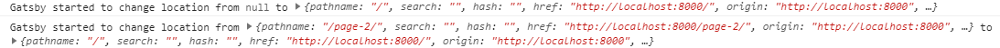

# Repro steps

1. Run `npm start`.
2. Navigate to another page, e.g., Page 2.
3. Examine the console output.

The first time it's called (moving from `null` to a page) is correct. All further invocations have the `location` and `prevLocation` parameters swapped, so the page is going "from" and "to" in the wrong direction.

Example output:

